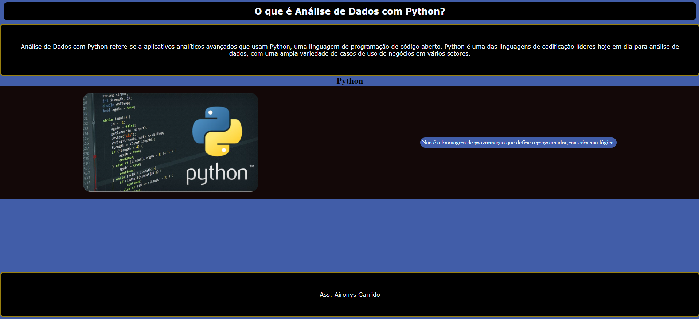

    <h1>O que é Análise de Dados com Python?</h1>
    
Análise de Dados com Python refere-se a aplicativos analíticos avançados que usam Python, uma linguagem de programação de código aberto. Python é uma das linguagens de codificação líderes hoje em dia para análise de dados, com uma ampla variedade de casos de uso de negócios em vários setores.

    

